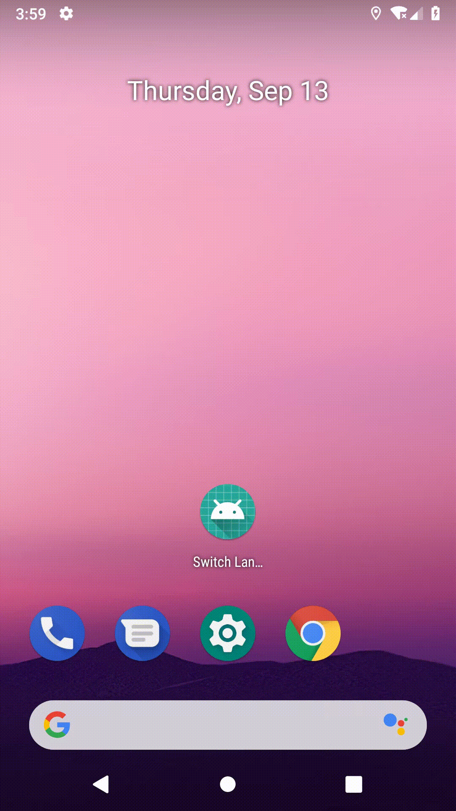

# Switch Language Utils

[](http://www.apache.org/licenses/LICENSE-2.0.html)
[  ](https://bintray.com/zyhang/maven/SwitchLanguage/_latestVersion)



## Usage

### 重写Activity
```java
@Override
protected void attachBaseContext(Context newBase) {
    super.attachBaseContext(SwitchLanguageUtils.configLanguage(newBase));
}
```

### 切换语言
```kotlin
SwitchLanguageUtils.startSwitchLanguage(Locale.CHINA, 1000)
```

## Installation

```groovy
implementation 'com.zyhang:switchlanguage:<latest-version>'
```